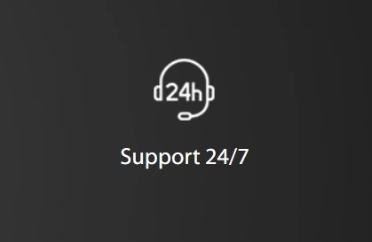

# GTHost真的靠谱吗？一个老实人的使用体验

你有没有遇到过这种情况：网站访客遍布全球，但服务器就那么几个地方，结果远距离的用户打开你的网站慢得要命？或者，你正计划拓展海外市场，但又担心速度跟不上？

这次我们测试了GTHost这个托管平台，它在全球有17个数据中心，而且可以根据你的实际需求自定义服务器配置。说实话，开始我也半信半疑，但用下来确实有些意外收获。

---

## GTHost是什么来头

GTHost全称GLOBALTELELEHOST Corp，2012年成立的。他们的理念挺简单：让全球范围内的服务器托管变得既好用又不贵。

最吸引我的是这点——17个数据中心遍布全球，你可以根据存储需求和位置来选服务器。不是那种"给你几个套餐挑一个"的模式，而是你说了算，需要什么配置就配什么。

## 数据中心都在哪

GTHost的17个数据中心分布在全球各地，基本覆盖了主要市场区域。

这个覆盖范围意味着什么？假设你的客户主要在亚洲、欧洲和北美，你就可以在这些地区分别部署服务器，让用户访问时都能就近连接。理论上讲，服务器离用户越近，网站打开速度就越快。

## 安全性怎么样

做网站的都知道，数据这东西丢了就完了。几个月甚至几年的心血说没就没，那种感觉......所以安全这块我特别关注。

GTHost提供DDoS攻击防护，这是基础配置。更重要的是，他们不允许用户从自己的服务器攻击别人——这点听起来是废话，但有些低端服务商根本不管这个。所有数据都用SSL加密，这个也是标配了。

说实话，安全这块没什么花哨的，就是该做的都做到位了。

## 客服靠不靠谱

👉 [换新服务商最怕的就是出问题没人管，看看GTHost的客服响应速度如何](https://cp.gthost.com/en/join/72c7e6b2fc118929f9ede2978f008806)

我实测了一下，他们确实是24/7在线。打电话、发邮件、在线聊天都行。有一次凌晨两点多遇到个配置问题，抱着试试看的心态发了个工单，结果十几分钟就有人回复了。

虽然不是所有问题都能秒解决，但至少人家在那儿，这就让人踏实多了。

## 几个值得说的功能

### 带宽不限量

这个真的解决了我一个大问题。之前用别的服务商，每个月盯着带宽用量，生怕超了要加钱。GTHost直接给你不限量，网站流量突然暴增也不慌。

你知道那种感觉吗？就像手机套餐从有限流量换成无限流量，虽然平时可能用不了那么多，但心里就是爽。

### 5-15分钟上线

下单到服务器可用，最快5分钟，慢点也就15分钟。这个速度在行业里算快的了。

我记得之前用某个服务商，从付款到真正能用，等了快两小时。那种等待的感觉......就像点了外卖一直不来，急得团团转。

### 完全的Root权限

这个对技术人员来说很重要。你对服务器有完全控制权，想怎么配置就怎么配置，不用申请什么权限，也不用等别人帮你操作。

当然，这也意味着你要自己负责——配错了可别怪平台。

## 价格和套餐

GTHost主要做的是专用服务器。价格？这得看你选什么配置和位置，因为是自定义的。

起步价大概是59美元/月。听起来不算特别便宜，但考虑到你能拿到的东西——全球数据中心选择、不限带宽、完全控制权——这个价格其实还行。

## 值不值得用

说实话，如果你只是想搞个小博客或者刚起步的网站，GTHost可能有点大材小用了。但如果你：

- 业务覆盖多个国家或地区
- 需要灵活配置服务器
- 对速度和稳定性要求比较高
- 有一定的技术能力（或者团队里有懂技术的人）

那GTHost确实是个不错的选择。它不是那种"小白友好型"的服务商，但给了你足够的自由度和性能保障。

## 几个常见问题

**有免费试用吗？**

没有完全免费的，但有1-10个低成本试用期。具体怎么算，建议去看他们的服务条款，写得挺详细的。

**最便宜多少钱？**

因为是自定义配置，所以没有固定价格。最低大概59美元/月起，具体看你选什么。

**客服怎么联系？**

电话、在线聊天、邮件都行。而且他们针对不同类型的问题（技术的、账单的）有专门的邮箱。

**只提供专用服务器吗？**

主要是专用服务器。你可以选位置、选存储空间，基本上都是独立的服务器资源。

---

## 最后说两句

用了一段时间GTHost，整体感觉还是挺稳的。17个全球数据中心确实不是吹的，对于需要服务多地区用户的网站来说，这个优势很明显。

不限带宽这点也解决了很多后顾之忧，再也不用每天盯着流量用量了。DDoS防护和SSL加密这些基础安全措施都做得挺到位。

如果你正在找一个👉 [能覆盖全球、配置灵活、性能稳定的托管服务](https://cp.gthost.com/en/join/72c7e6b2fc118929f9ede2978f008806)，GTHost值得考虑。当然，前提是你愿意为这些功能付出相应的成本，毕竟一分钱一分货。
